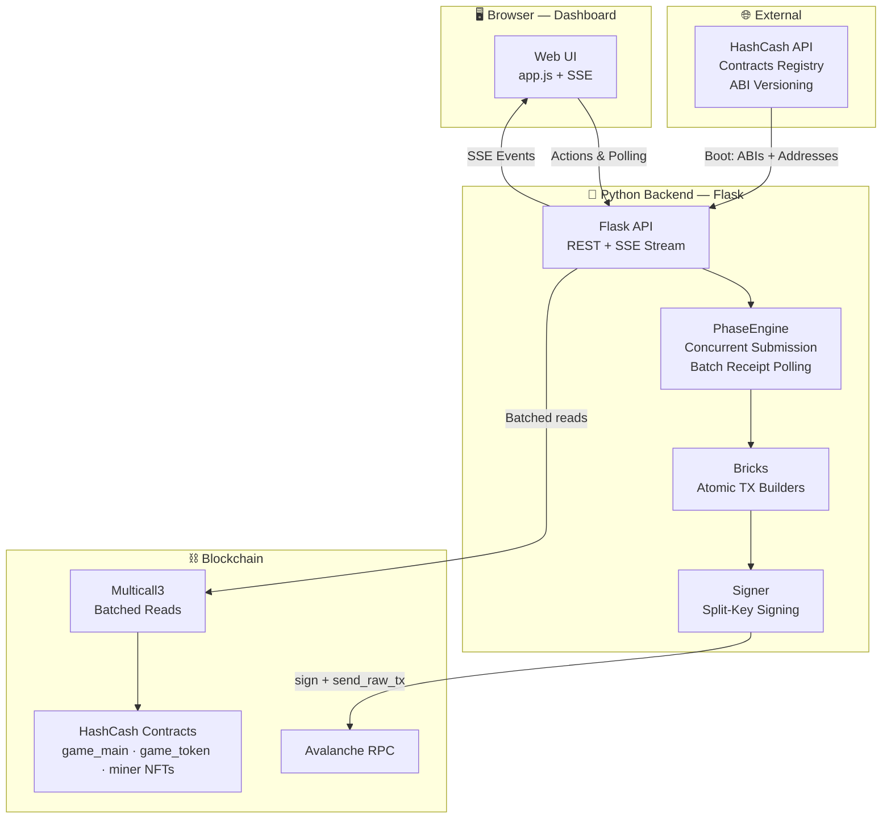
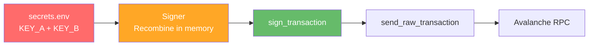

<p align="center">
  
</p>

<h1 align="center">HashOps</h1>
<h3 align="center"><em>Streamline your mining operations</em></h3>

<p align="center">
  A powerful batch transaction orchestrator for HashCash Club on Avalanche C-Chain.<br/>
  Built to manage dozens of facilities & miners across multiple wallets in seconds.
</p>

<p align="center">
  
  
  
  
  
</p>

<p align="center">
  <a href="#what-is-HashOps">What is HashOps?</a> · 
  <a href="#built-with">Built With</a> · 
  <a href="#features">Features</a> · 
  <a href="#getting-started">Getting Started</a> · 
  <a href="#architecture">Architecture</a> · 
  <a href="#security-model--current-state">Security</a> · 
  <a href="#the-road-to-a-web-application">Road to Web App</a> ·
  <a href="#about-the-developer">About</a> · 
  <a href="#license">License</a>
</p>

<p align="center">
  <a href="#screenshots">HD Screenshots</a>  ·  
  <a href="https://www.youtube.com/playlist?list=PLwSxDOezqqyO62SvNaHq_jCFBO72HJAfI">Demonstration videos (no sound)</a>  ·  
  Sorry, the recording quality isn't exactly great, but at least it shows everything!
</p>

<h3 align="center">Interested in using or contributing to HashOps?</h3>
<p align="center">
  <a align="center" href="https://x.com/UNKW_TW">Feel free to reach me out on X. I'm open to discussion!</a>
</p>
<p align="center">
  Built with curiosity (and a lot of time) - 2026
</p>

---
---

> [!CAUTION]
> 
> # **Disclaimer**
> 
> HashOps interacts directly with blockchain smart contracts and handles real assets. The bot has been **used daily for over a month** on mainnet without any issue in a controlled environment.
>
> That said, you are solely responsible for any damage or losses resulting from infected hardware, misuse of the bot, or any modifications you make to it. The code is provided as-is for demonstration purposes — **always review what you run**, especially when private keys are involved.
>
>  **Use at your own risk. Use in a clean, secure environment. Stay safe.**

---
---

## What is HashOps?

Managing mining operations on HashCash becomes tedious when you own **dozens of facilities or hundreds of miners/NFTs spread across multiple wallets**. The native game interface handles one wallet at a time and requires manual confirmation for every single transaction. This means spending hours clicking through the same repetitive flows.

**HashOps solves this.** It's a local bot with a rich web dashboard that lets you:

- **Execute batch transactions** across all your wallets simultaneously — claim rewards, withdraw/transfer/place miners, dispatch gas — all in a few clicks
- **Fire dozens of transactions in seconds**, not minutes. The PhaseEngine submits transactions concurrently and polls receipts in batch, so a full Withdraw → Transfer → Place cycle across wallets completes before you finish your coffee
- **Track everything in real-time** through a polished, intuitive UI with live logs (SSE), per-wallet status cards, and a global miner inventory view
- **Stay safe** with built-in gas price safety limits, EIP-1559 optimization, and a privacy mode that hides balances and addresses on screen

**In short:**<br/>
**What takes 30+ minutes manually on the game UI takes about 15 seconds with HashOps.**

---

## Built With

| Technology | Role |
|---|---|
| **Python 3.10+** | Core backend language |
| **Flask 3.1** | Lightweight HTTP server & REST API |
| **Web3.py 7.15** | Ethereum/Avalanche blockchain interaction |
| **Multicall3** | Batched on-chain reads (universal EVM contract) |
| **Server-Sent Events (SSE)** | Real-time log streaming to the dashboard |
| **Vanilla JS** | Full SPA-like frontend (no framework) |
| **Vanilla CSS** | Custom styling (no Tailwind) |
| **HashCash Public API** | Dynamic contract & ABI resolution with SHA-256 integrity verification |

> [!NOTE]
> As explained in the various sections, I chose Python because I’m more familiar with it than with other technologies that are better suited for deploying web apps. My primary goal was to keep things as simple as possible on a local machine without needing a bot running 24/7.<br/>
But the announcement of the Hashathon made me want to share, refine what I’d built and try to figure out what could be done.

---

## Features

| Feature | Description |
|---|---|
| 🗃️ **Real-time view of facilities** | View important details about the address and its associated facility with ease. $hCASH and $AVAX balances, hash power, power consumption, and more... |
| 💎 **Claim Rewards** | Batch-claim pending hCASH rewards from all wallets, auto-transfer to main wallet if above threshold |
| ⛏️ **Manage Miners (Batch)** | Withdraw, Transfer & Place miner NFTs in mass across wallets with a single modal — complete Withdraw → Transfer → Place pipelines |
| ⛽ **Dispatch Gas Fees** | Smart AVAX distribution algorithm that auto-balances gas across all wallets using a debt-matching system |
| 📊 **Live Dashboard** | Real-time tracking of assets across 3 logical states: **In-Game** (active miners), **Inventory** (ready to place), and **Marketplace** (actively listed). Includes grid/list views & SSE terminal |
| 🔒 **Privacy Mode** | One-click toggle to hide all sensitive data (balances, addresses) from the UI |
| 🔄 **Multicall3 Optimization** | All blockchain reads are batched via Multicall3 — fetching balances, rewards, facility data & miners for 50 wallets in a single RPC call |
| 🧠 **Dynamic ABI Resolution** | Contract addresses & ABIs are fetched from the official HashCash API at startup — no hardcoded addresses, fully future-proof |
| ⚡ **PhaseEngine** | Declarative, phase-based transaction orchestrator with concurrent submission, batch receipt polling, and automatic error propagation between phases |
| 🛡️ **Universal Integrity Guard** | Hardened security engine (`security.py`) that enforces strict whitelisting of authorized wallets and official contracts. Features hardcoded "Safety Anchors" and a fail-safe mechanism that blocks all interactions if protocol anomalies are detected |
| 🛡️ **Debt Safety Mechanism** | Real-time monitoring of facility debt. Automatically blocks dangerous actions (Claim, Withdraw, Place) on affected wallets to prevent unintended token loss |
| 📢 **Dashboard Health Monitoring** | Centralized, real-time observability system that monitors RPC connectivity, API limits, and Gas safety — featuring a persistence layer to sync health status between the boot sequence and the dashboard |
| 🚑 **Anti-Stuck Rescue System** | Batch RPC diagnostics for stuck or ghost transactions. Automatically triggers RBF (Speed-Up) or Nonce Self-Healing (gap correction) natively within the orchestrator |

### Observability & Health Monitoring

HashOps includes a robust monitoring layer designed to keep the operator informed of infrastructure states that could impact performance or safety.

- **RPC Resilience**: Constant monitoring of the Avalanche node connection. Detects outages and automatically broadcasts status updates to the UI tray.
- **Circuit Breaker & Rate Limits**: Awareness of HashCash API HTTP `429` (Rate Limit) and `5xx` (Server Error). Implements a defensive circuit breaker to prevent repeated calls during downtime and provides real-time cooldown visibility.
- **Gas Safety Guard**: Real-time monitoring of network fees against your configured `GAS_SAFETY_MAX_GWEI`. Automatically pauses core transactions until fees drop to safe levels, with clear UI feedback.
- **Debt Safety Guard**: Continuous evaluation of wallet net status. Detects "Facility Debt" (when power fees > rewards). Triggers high-priority permanent UI banners and implements a hard-block on interactions with the game contract (Claim, Place, Withdraw) for debt-affected wallets to prevent involuntary debt payment.
- **Persistence & Sync**: Unlike transient notifications (toasts), system-level alerts remain active in the global tray until the underlying issue is resolved. These states are synchronized between the backend engine and the web dashboard, ensuring no visibility gap after a page refresh.

---

## Getting Started

> [!NOTE]
> Before you get started, please read the README file in its entirety to fully understand what the bot does, the issues involved, the challenges, the objectives, ...

### Prerequisites

- Python 3.10+
- An Avalanche RPC endpoint (e.g., Infura, Ankr, public RPC)
- A HashCash API key ([hashcash.club](https://hashcash.club/account))

### Installation

```bash
# Clone the repository
git clone https://github.com/hkoff/HashOps
cd HashOps

# Install dependencies
pip install -r requirements.txt
```

> [!CAUTION]
> **As a general rule, NEVER export, copy or use the private key of a cold wallet > N E V E R**<br/>
> **ALWAYS use a burner, hot wallet and keep as little balance as possible in it at all times.**

> [!WARNING]
> **Hardened Key Management:** To prevent accidental leaks and scraping by malicious dependencies or subprocesses, HashOps uses a strict memory-only configuration policy.
> 1. Private keys are never loaded into the global OS environment (`os.environ`).
> 2. Keys are split into two halves (KEY_A + KEY_B) in your configuration file.
> 3. They are recombined strictly in localized memory via the `Signer` class, and the raw key is purged from the execution stack immediately after account initialization.

### Configuration

**Rename the `DEFAULT-secrets.env` file located in the project root directory to `secrets.env`, only then edit it as indicated in the file (don't forget to save).**

You can add as many wallets as you want! Just follow the instructions in the `DEFAULT-secrets.env` file.

### Launch

```bash
python main.py
```

The dashboard opens automatically at `http://127.0.0.1:5001`.

---

## Architecture

```
HashOps/
├── main.py                            # Entry point — boots everything in sequence
├── secrets.env                        # Private keys & RPC config (local only, gitignored)
├── data/
│   ├── abi_cache/                     # Immutable ABI cache (SHA-256 verified)
│   └── miner_types_cache.json         # Miner metadata cache (names, images, stats)
└── src/
    ├── config.py                      # All constants, thresholds & paths
    ├── core/
    │   ├── blockchain.py                    # RPC reads, Multicall3 batching, Marketplace V3 sync & NFT ID resolution
    │   ├── gas.py                           # EIP-1559 gas calculation with safety cap
    │   ├── hcash_api.py                     # Official HashCash API client (contracts + ABIs)
    │   ├── security.py                      # Universal Integrity Guard (Whitelist & Anchors)
    │   ├── signer.py                        # Private key encapsulation (split-key, no leak)
    │   └── wallets.py                       # Wallet loading from secrets.env
    ├── actions/
    │   ├── phase_engine.py                  # Declarative phase-based TX orchestrator
    │   ├── claim_rewards.py                 # Claim orchestrator (Claim → Transfer to mail wallet)
    │   ├── batch_handle_nft_miners.py       # Miner orchestrator (Withdraw → Transfer → Place)
    │   ├── dispatch_gas.py                  # Gas dispatch orchestrator (debt-matching algorithm)
    │   ├── ui_alerts.py                     # Real-time System Alerts bridge (SSE)
    │   ├── ui_state.py                      # Thread-safe UI state management
    │   ├── utils.py                         # Batch receipt polling, nonce management, revert diagnostics
    │   └── bricks/                          # Atomic transaction builders
    │       ├── claim_hcash.py               #   └── claimRewards()
    │       ├── withdraw_miner.py            #   └── withdrawMiner(id)
    │       ├── transfer_miner.py            #   └── safeTransferFrom(from, to, tokenId)
    │       ├── place_miner.py               #   └── placeMiner(nft, id, x, y) + setApprovalForAll
    │       ├── transfer_hcash.py            #   └── transfer(to, amount)
    │       └── transfer_avax.py             #   └── Native AVAX transfer
    ├── services/
    │   ├── logger_setup.py            # Centralized logging
    │   └── miner_cache.py             # Miner types cache management
    ├── utils/
    │   └── helpers.py                 # Custom Web3 provider, colors, formatting
    └── web_ui/
        ├── app.py                     # Flask server & REST API routes
        ├── sse.py                     # SSE infrastructure & real-time log bridge
        ├── templates/index.html       # Single-page dashboard
        └── static/
            ├── app.js                 # Core SPA logic (init, routing, event binding)
            ├── loader.js              # Boot sequence & dynamic module loader
            ├── privacy_module.js      # Privacy blur & data randomization modes
            ├── style.css              # Custom styling (vanilla CSS)
            ├── icons/                 # SVG icon sprites
            └── modules/
                ├── api.js             #   REST API client layer
                ├── state.js           #   Centralized frontend state
                ├── layout.js          #   Dashboard layout & responsive handling
                ├── cards.js           #   Wallet status cards (Action View)
                ├── miners.js          #   Miner inventory grid & list views
                ├── miner-modal.js     #   Batch miner management modal
                ├── sidebar.js         #   Sidebar navigation & wallet selector
                └── utils.js           #   Shared UI helpers & formatters
```

### Core Flow



### The PhaseEngine

The heart of HashOps is the **PhaseEngine**, a declarative phase-based orchestrator that handles the full lifecycle of batch blockchain operations:

```
Phase Definition (Declarative)
  │
  ├── 1. prepare_fn()     → Estimate gas once for the whole batch
  │
  ├── 2. submit_fn()      → Submit TXs concurrently (ThreadPoolExecutor)
  │       └── Each brick: build_tx → sign → send_raw_transaction
  │
  ├── 3. on_submit_error() → Handle wallets that failed to submit
  │
  └── 4. wait_batch()      → Poll receipts in batch (single RPC call)
          ├── on_receipt_success()  → Update UI, advance state
          ├── on_receipt_error()    → Batch revert diagnostics (Out of Gas / EVM Revert reason)
          └── Timeout / Stuck TXs   → Trigger Rescue Loop (Auto)
                  ├── Batch RPC Diagnostics
                  ├── Auto-Heal Nonce Gaps & RBF Speed-Ups
                  └── IF rescue fails → on_receipt_error() (Mark failed, block phases)
```

**Error propagation is automatic:** The PhaseEngine first attempts to rescue stuck transactions dynamically. If a transaction ultimately fails or becomes unrecoverable (e.g., during the Withdraw phase), the affected wallet is automatically excluded from all subsequent dependent phases (Transfer, Place) — no manual intervention needed. 
If a problem arises, you can easily see what it is and troubleshoot it using the live logs or the on-chain transaction, which is just a click away.

---

## Security Model — Current State

HashOps currently runs as a **local-only application**. All private keys stay on your machine:



**What's in place:**
- **Triple-Lock Validation**: Every transaction is verified at three distinct levels: the API entry point (payload scan), the Orchestrator (batch logic), and the atomic "Brick" level (just before signing).
- **Authorized Wallet Whitelist**: The bot only interacts with wallets explicitly defined in your `.env`. Signing transactions for external or unknown addresses is programmatically impossible.
- **Hardcoded Safety Anchors**: Core contract addresses (Main Game, Token) are hardcoded as a "Ground Truth". If the official API returns mismatched addresses, the bot fails closed and blocks all transaction signing.
- **Asset Integrity Guard**: Strict verification of native AVAX and hCASH movements to ensure tokens are only moved between whitelisted burner wallets and official infrastructure.
- **Private Key Isolation**: Keys are split into fragments, loaded only in memory, and never exposed to the UI, logs, or persistent caches.
- **Local Binding**: The Flask server only binds to `127.0.0.1` (localhost) — not accessible from the network.

**What this means:**
- ✅ Perfectly safe for personal use on your own device in a clean and secure environment. I am not liable for any losses resulting from infected hardware or misuse of the bot.
- ❌ **Not deployable as a public web application** in its current form.

---

## The Road to a Web Application

Just a quick note about the interface: I didn't go all out on responsiveness because I didn't need it. However, it should work pretty well on smaller computer screens and perfectly on larger ones.

The ultimate goal would be to make HashOps available as a **public web application** accessible to anyone through their browser. However, this introduces a fundamental security challenge.

### The Problem

Today, the backend **holds the private keys and signs the transactions server-side**. This is fine locally, but completely unacceptable for a public deployment — **no user should ever send their private key to a remote server**.

Moreover, I'm not quite sure how I could host and deploy the system as a web application. It's hard to weigh the pros and cons and determine whether users would be interested in using it.

### The Challenge

HashOps's core value proposition is **automation at scale**: submitting dozens of transactions in seconds across multiple wallets through phase-based pipeline. Moving to browser-based wallet signing (MetaMask / Rabby) means:

- Each transaction requires **manual user approval** in the browser extension
- The PhaseEngine's concurrent submission model would need to become **asynchronous** waiting for the user to sign between each step
- Batch efficiency drops significantly when a human is in the loop

### Possible Approach

The backend would become a **read-only orchestrator** building unsigned transactions and tracking receipts while the browser wallet handles all signing. This preserves the dashboard experience while ensuring private keys never leave the user’s device and that there is no need to enter them into the system.

**This is a hard problem** and I honestly don't know how to implement it properly yet. But the foundation is solid and the architecture is modular enough to make this transition possible.

---

## About the Developer

I'm not a professional developer. I'm a tinkerer who loves building things.

The entire Web3 interaction layer of HashOps has been **largely vibecoded**, built iteratively with AI assistance, then globally reviewed and optimized by myself to the best of my abilities. I've spent considerable time understanding how transactions, gas estimation, nonce management, and Multicall3 batching work. Even though I don't understand everything perfectly and I don't pretend to master every edge case.

**What I can say is: it works.** And it works well. The bot reliably handles multi-phase, multi-wallet operations on mainnet with real assets. The UI is functional, responsive, and genuinely pleasant to use.

I know the code isn't perfect and probably never will be because it takes forever. But that's okay!

I built HashOps because I needed it. Managing my own mining activities across multiple wallets was starting to feel like a bit of a chore, and I thought: *"there has to be a better way."* Turns out, there is, I just had to build it myself.

If you're interested in collaborating, extending HashOps to support more actions, or helping figure out the web deployment challenge. I'd love to hear from you.

---

## License

**All Rights Reserved** — This project is shared for demonstration and evaluation purposes only.

The source code of **HashOps itself** (the bot, its orchestrators, its UI, and its architecture) is not licensed for redistribution, modification, or commercial use without explicit written permission from the author.

HashOps relies on and interacts with third-party technologies, platforms, and protocols. All rights related to these belong to their respective owners:

- **[HashCash](https://hashcash.club)** — Smart contracts, public API, game design & assets
- **[Avalanche](https://www.avax.network/)** — Blockchain network (C-Chain)
- **[Multicall3](https://www.multicall3.com/)** — Universal batching contract
- **[Web3.py](https://web3py.readthedocs.io/)**, **[Flask](https://flask.palletsprojects.com/)**, and all other open-source dependencies listed in `requirements.txt`

This project claims no ownership, affiliation, or endorsement from any of these parties.

---

## Screenshots

> [!NOTE]
> For security reasons, private data (IDs, wallets, amounts, hashes, etc.) is randomized via script during the demonstrations. You may notice inconsistencies, such as addresses or hashes that change; this is normal. The goal is to show exactly what the interface looks like without having to blur all the private information.
Without the script running, all the informations are genuine, can be clicked on and redirect to Debank for wallets or Snowtrace for transactions.

<p align="center">
  
  <br/><em>Welcoming Screen</em>
</p>

<p align="center">
  
  <br/><em>Wallets view</em>

</p>

<p align="center">
  
  <br/><em>Action View</em>
</p>

<p align="center">
  
  <br/><em>Manage Miners — Batch modal for Withdraw / Transfer / Place</em>
</p>

<p align="center">
  
  <br/><em>Manage Miners — Grid view of Batch modal</em>
</p>

